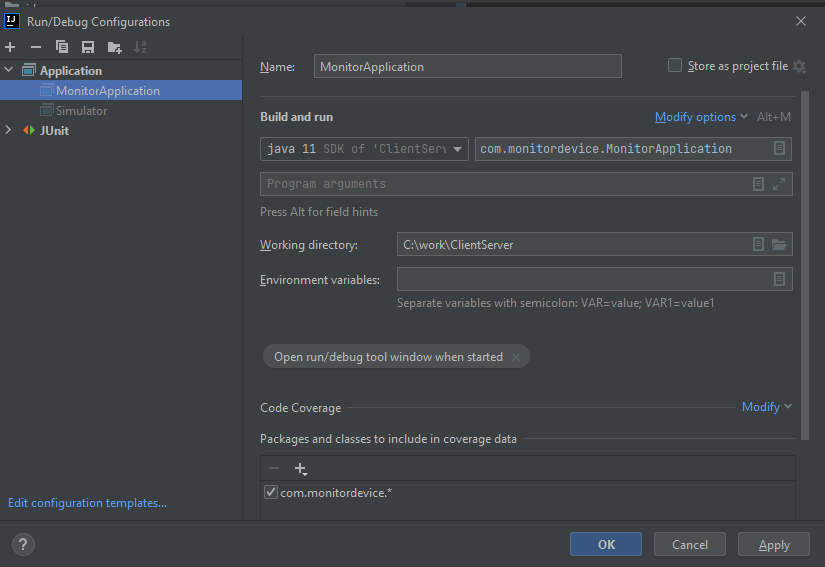
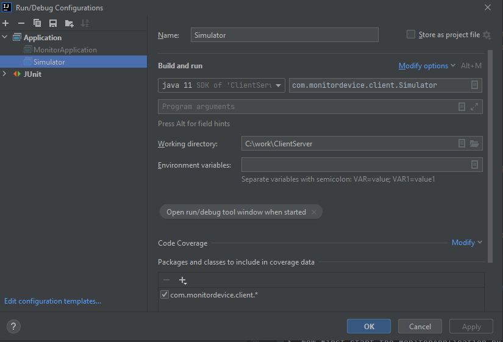
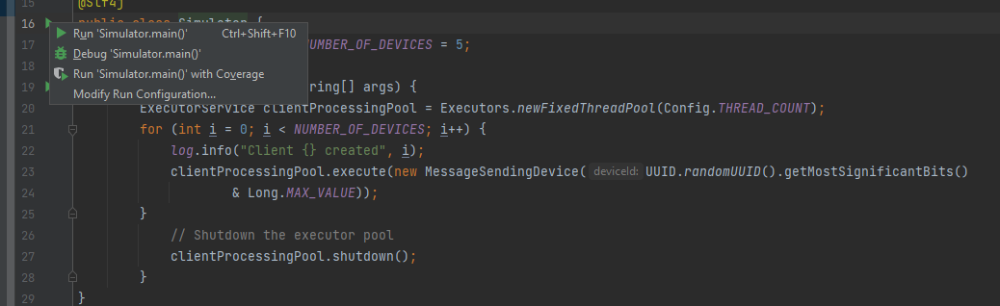
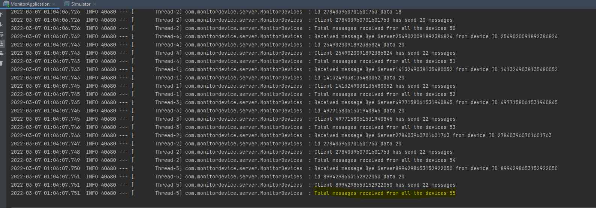

# Monitor Application

## Description

This application is implementing a simulation in which one monitoring device and multiple measurement devices interact and exchange data; each device has a unique id . The monitor needs to count the number of messages sent by different devices.
The application is making use of Java web sockets.

## How to run the application

### Prerequisite

Preferred Editor : Intellij
Please ensure Git, Java SDK 1.8 and maven is in installed and, is set in the path.

Download the project and import it as Maven project.

**Run Command** mvn clean install

**Build run Configuration**
1. Create run configuration for MonitorApplication, MonitorApplication starts a springboot application and, it is responsible to start the monitoring server. Alternatively, navigate to the com.monitordevice.MonitorApplication and Run the main method. 

   

2. Create run configuration for Simulator, it will run multiple devices which sends the messages to the monitor server. Alternatively, navigate to the com.monitordevice.client.simulator and Run the main method.

   

   

3. Now first start the MonitorApplication by running the configuration and then start the simulator

**Expected Output**

   
Check in the Run Window
